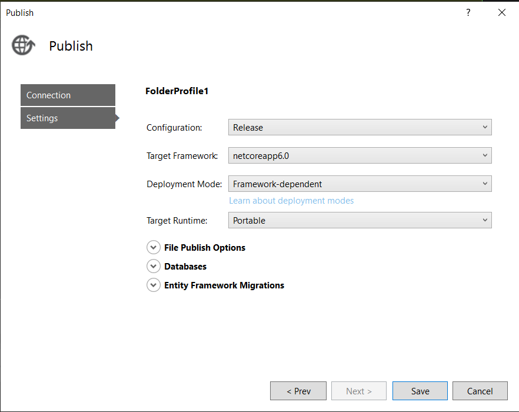
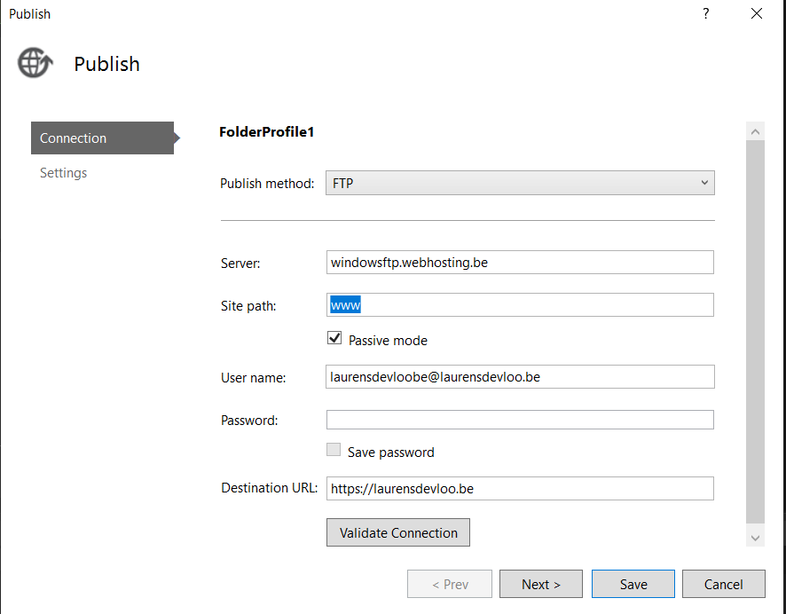
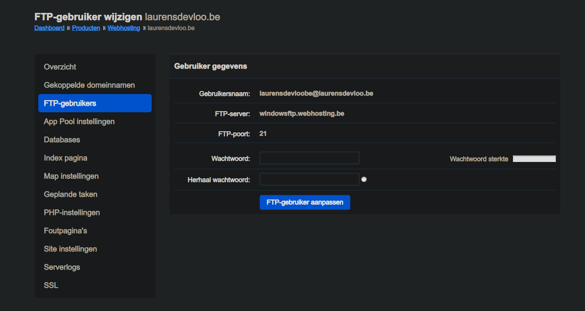
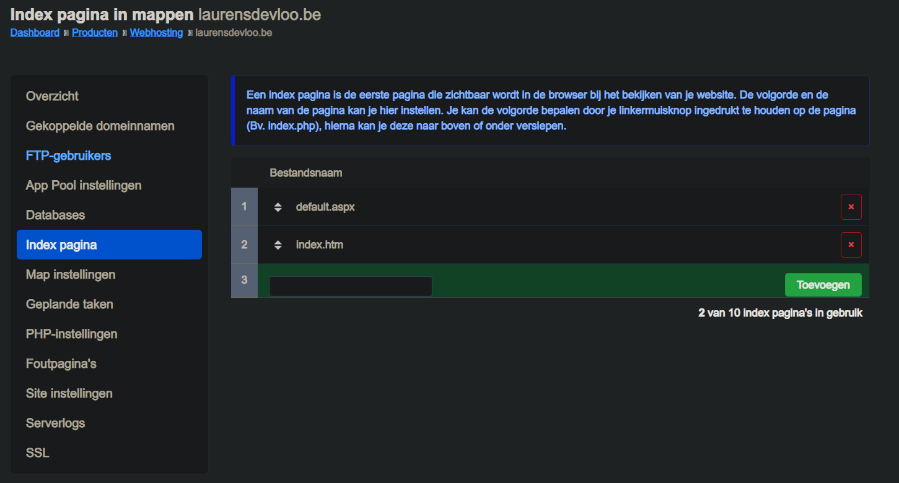
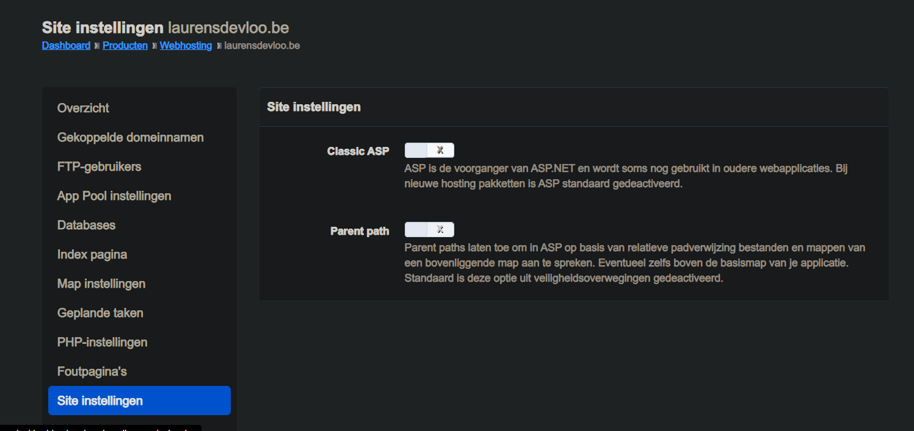

# LaurensDevloo.github.io

Deploy naar website door te publishen a.d.h.v. ftps en hier alles in te vullen hierna is het mogelijk de settings aan te passen en hier opnieuw alles goed te zetten. 

zie  & 

Rest van de settings zijn:   
